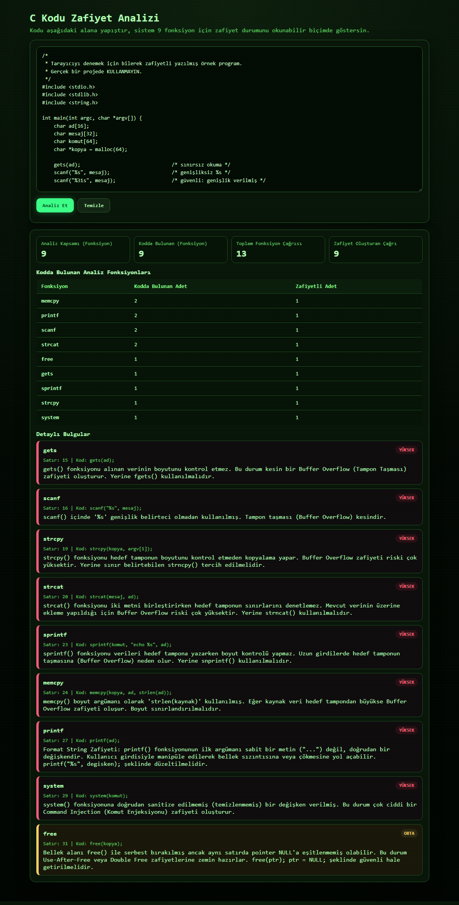

# C Kodu Zafiyet Analizi

C kaynak kodunu tarayıp tampon taşması, format string ve komut enjeksiyonu gibi zafiyetlere yol açan riskli fonksiyon kullanımlarını satır satır raporlayan statik analiz aracı. Web arayüzü, komut satırı aracı ve JSON API olarak kullanılabilir.

> **English:** A lightweight static analyzer that scans C source code for risky uses of nine commonly misused libc functions (`gets`, `scanf`, `memcpy`, `strcpy`, `sprintf`, `strcat`, `free`, `system`, `printf`) and reports each finding with its line number, severity and an explanation. Ships with a Flask web UI, a CLI and a JSON API. The interface and findings are in Turkish.

<p align="center">
  
</p>

## Özellikler

- **9 fonksiyon ailesi için kural tabanlı tarama.** Yalnızca fonksiyonun adına değil, nasıl çağrıldığına bakar: `scanf("%31s", ...)` veya `memcpy(a, b, sizeof(a))` gibi güvenli kullanımlar raporlanmaz.
- **Açıklamalı bulgular.** Her bulgu satır numarası, ilgili kod satırı, şiddet düzeyi (yüksek / orta) ve neden riskli olduğunu anlatan bir açıklama içerir.
- **Yorumlar ve metinler ayırt edilir.** `//` ve `/* */` yorumları taramadan önce temizlenir; yorum satırına alınmış bir `gets()` bulgu üretmez.
- **Kullanım özeti.** Her fonksiyon için kodda kaç kez geçtiği ve bunların kaçının zafiyetli olduğu ayrıca hesaplanır.
- **Üç kullanım biçimi.** Tarayıcıdan, terminalden veya HTTP üzerinden.
- **Bağımlılıksız analiz çekirdeği.** `analyzer.py` yalnızca Python standart kütüphanesini kullanır; ayrıştırma düzenli ifadeler olmadan, elle yazılmış yardımcı fonksiyonlarla yapılır.

## Tespit edilen kalıplar

| Fonksiyon | Raporlanan durum | Şiddet |
|---|---|---|
| `gets` | Her kullanım | Yüksek |
| `scanf` ailesi¹ | `%s` veya `%[...]` genişlik belirtilmeden kullanılmış | Yüksek |
| | Format metni satırda sabit olarak yer almıyor | Orta |
| `memcpy` | Boyut argümanı `strlen(...)` ile hesaplanmış ya da eksik | Yüksek |
| | Boyut argümanı sabit bir sayı veya doğrulanamayan bir değişken | Orta |
| `strcpy` | Her kullanım | Yüksek |
| `strncpy` | Boyut argümanında `strlen(...)` kullanılmış | Yüksek |
| `sprintf` | Her kullanım (`snprintf` güvenli kabul edilir) | Yüksek |
| `strcat` | Her kullanım | Yüksek |
| `strncat` | Boyut argümanında `strlen(...)` kullanılmış² | Yüksek |
| `free` | Aynı satırda işaretçi `NULL` yapılmamış | Orta |
| `system` | Argüman sabit bir metin değil | Yüksek |
| `printf` | İlk argüman sabit bir format metni değil | Yüksek |

¹ `scanf`, `sscanf`, `fscanf`, `vscanf`, `vsscanf`, `vfscanf`  
² `sizeof(hedef) - strlen(hedef) - 1` biçimindeki kalan alan hesabı güvenli kabul edilir.

## Kurulum

Python 3.9 veya üzeri gerekir (3.12 ile test edildi).

```bash
git clone https://github.com/TaylannAktas/C-kodu-analizi.git
cd C-kodu-analizi

python -m venv .venv
source .venv/bin/activate        # Windows: .venv\Scripts\activate

pip install -r requirements.txt
```

## Kullanım

### Web arayüzü

```bash
python app.py
```

Ardından tarayıcıda <http://localhost:5000> adresini açın, C kodunu yapıştırın ve **Analiz Et**'e basın. Denemek için [`examples/zafiyetli_ornek.c`](examples/zafiyetli_ornek.c) dosyasını kullanabilirsiniz.

### Komut satırı

```bash
python cli_scan.py examples/zafiyetli_ornek.c
```

```text
=== 9 Fonksiyon Icin Analiz Sonucu ===
gets     -> Zafiyetli (kullanim: 1, bulgu: 1)
scanf    -> Zafiyetli (kullanim: 2, bulgu: 1)
memcpy   -> Zafiyetli (kullanim: 2, bulgu: 1)
...

=== Detayli Bulgular ===
1. [YÜKSEK] Satir 15 - gets: gets() fonksiyonu alınan verinin boyutunu kontrol etmez. ...
2. [YÜKSEK] Satir 16 - scanf: scanf() içinde '%s' genişlik belirteci olmadan kullanılmış. ...
```

Dosya adı verilmezse kod terminale yapıştırılarak girilir; boş bir satır girişi sonlandırır.

### API

`POST /api/scan` uç noktası, `code` alanında C kodu bekler:

```bash
curl -X POST http://localhost:5000/api/scan \
  -H "Content-Type: application/json" \
  -d '{"code": "char b[8];\ngets(b);"}'
```

```json
{
  "status": "success",
  "toplam_zafiyet": 1,
  "zafiyetler": [
    {
      "fonksiyon": "gets",
      "satir_no": 2,
      "kod_satiri": "gets(b);",
      "siddet": "yüksek",
      "sebep": "gets() fonksiyonu alınan verinin boyutunu kontrol etmez. ..."
    }
  ],
  "fonksiyon_durumlari": {
    "gets": {
      "durum": "zafiyetli",
      "zafiyetli": true,
      "kullanim_sayisi": 1,
      "bulgu_sayisi": 1,
      "guvenli_kullanim_sayisi": 0
    }
  }
}
```

`fonksiyon_durumlari` izlenen dokuz fonksiyonun tamamını içerir; yukarıda yalnızca biri gösterilmiştir. `durum` alanı `zafiyetli`, `guvenli` veya `kullanilmadi` değerlerinden birini alır.

| Uç nokta | Yöntem | Açıklama |
|---|---|---|
| `/` | GET | Web arayüzü |
| `/api/scan` | POST | Gönderilen kodu analiz eder |
| `/health` | GET | Sunucunun çalıştığını doğrular |

## Nasıl çalışır?

1. **Ön işleme.** `c_yorumlarini_temizle`, kaynak kodu karakter karakter gezerek yorumları siler. Metin sabitlerinin içindeki `//` gibi diziler yorum sayılmaz ve satır numaraları korunur.
2. **Kural motoru.** Her kural, `@zafiyet_kurali` dekoratörüyle kaydedilen ve bir satırı inceleyen bağımsız bir fonksiyondur. `kodu_tara` her satırı kayıtlı tüm kurallardan geçirir.
3. **Argüman analizi.** Kurallar çağrının argümanlarını iç içe parantezleri bozmadan ayırır ve boyut argümanının nasıl hesaplandığına (`sizeof`, `strlen`, sabit, değişken) göre karar verir.
4. **Özet.** `fonksiyon_durumlarini_hesapla`, fonksiyon ailelerinin (örneğin `strcat` ve `strncat`) kullanım ve bulgu sayılarını birleştirir.

### Yeni kural eklemek

`analyzer.py` içine dekoratörlü bir fonksiyon eklemek yeterlidir; zafiyet varsa bir sözlük, yoksa `None` döndürür:

```python
@zafiyet_kurali
def kural_ornek(satir_no: int, satir_icerik: str) -> Dict:
    if "tehlikeli_fonksiyon" in kelimeleri_cikar(satir_icerik):
        return {
            "fonksiyon": "tehlikeli_fonksiyon",
            "satir_no": satir_no,
            "kod_satiri": satir_icerik.strip(),
            "siddet": "yüksek",
            "sebep": "Neden riskli olduğunun açıklaması.",
        }
    return None
```

## Testler

```bash
pip install -r requirements-dev.txt
pytest
```

Testler hem analiz kurallarını (zafiyetli ve güvenli kullanımlar, yorum satırları) hem de API uç noktalarını kapsar.

## Proje yapısı

```text
.
├── analyzer.py            # Analiz çekirdeği: ön işleme, kurallar, özet
├── app.py                 # Flask sunucusu ve API
├── cli_scan.py            # Komut satırı aracı
├── templates/
│   └── index.html         # Web arayüzü
├── examples/
│   └── zafiyetli_ornek.c  # Denemek için bilerek zafiyetli yazılmış örnek
├── tests/
│   ├── test_analyzer.py
│   └── test_api.py
├── requirements.txt
└── requirements-dev.txt
```

## Sınırlamalar

Bu araç eğitim amaçlı, desen tabanlı bir tarayıcıdır; derleyici düzeyinde bir analiz yapmaz.

- Tarama satır bazlıdır. Birden fazla satıra bölünmüş çağrılar ve satırlar arası ilişkiler (örneğin `free(p);` ardından bir sonraki satırda `p = NULL;`) değerlendirilemez.
- Veri akışı izlenmez; bir değişkenin kullanıcı girdisinden gelip gelmediği veya tampon boyutlarının gerçekte yeterli olup olmadığı bilinmez. Bu yüzden hem yanlış pozitif hem de gözden kaçan durumlar olabilir.
- Makrolar ve ön işlemci yönergeleri genişletilmez.

Üretim kodunu denetlemek için derleyici uyarıları ve olgun statik analiz araçlarıyla birlikte kullanılmalıdır.

## Ekip

LevelUp kapsamında üç kişilik bir ekip olarak geliştirildi. Her ekip üyesi üç fonksiyonun kurallarını yazdı:

| | Kurallar |
|---|---|
| [Furkan](https://github.com/FurkanEmrecan) | `gets`, `scanf`, `memcpy` |
| [Taylan Tuna Aktaş](https://github.com/TaylannAktas) | `strcpy`, `sprintf`, `strcat` |
| [Alara](https://github.com/alaragungor) | `free`, `system`, `printf` |
